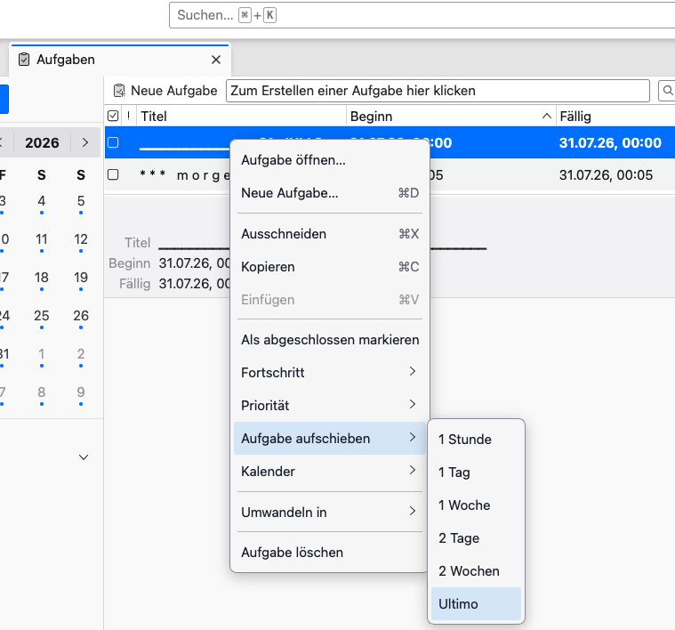

# ThunderbirdTasksPlus2

# Projektname
### **ThunderbirdTasksPlus2**

# Beschreibung
Eine Thunderbird Aufgabe (Task) um 2 Tage oder 2 Wochen aufschieben

1. Problemstellung
    - eine Aufgabe über das Kontext Menü mit **einem** Klick um 2 Tage bzw. 2 Wochen aufschieben 
2. Funktionsweise
		Die Erweiterung prüft Popup-Anzeigen darauf, ob es sich um das Aufschieben-Untermenü handelt und fügt dann die Menüpunkte "2 Tage" bzw. "2 Wochen" hinzu. Bei entsprechendem Klick werden das Von- und das Bis-Datum der Aufgabe entsprechend gesetzt.

# Verwendete Technologien
- Javascript
- Thunderbird .xpi Framework

# Quickstart

download [ThunderbirdTasksPlus2.xpi](https://github.com/gjpapa59-png/ThunderbirdTasksPlus2/blob/main/ThunderbirdTasksPlus2.xpi) und installiere das Addon in Thunderbird

# Installation

Eine `.xpi`-Datei wird in Thunderbird installiert, **indem Sie den Add-on-Manager öffnen, das Zahnrad-Symbol anklicken und die Option zum Installieren aus einer Datei wählen**.

Schritte zur Installation:
- **Add-ons öffnen**: Klicken Sie oben rechts auf das Menü (die drei waagerechten Linien) und wählen Sie **Add-ons und Themes** aus.
- **Zahnrad anklicken**: Klicken Sie oben neben der Suchleiste auf das **Zahnrad-Symbol** (Einstellungen für alle Add-ons).
- **Datei auswählen**: Wählen Sie im Menü **Add-on aus Datei installieren...**.
- **Bestätigen**: Suchen Sie Ihre `.xpi`-Datei auf dem Computer, wählen Sie diese aus und klicken Sie auf **Öffnen** sowie danach auf **Jetzt installieren**. 
## Anforderungen

Thunderbird Version **<mark style="background:#b1ffff">153.0.1</mark>** oder höher

## Known Issues

Angezeigte Texte sind auf Deutsch.
Derzeit sind keine Fehler oder Probleme bekannt. Fehler können über die Issue-Funktion gemeldet werden.
Dieses Addon ist unsigniert.

## Warnung

Um ein unsigniertes Add-on (.xpi) in Thunderbird zu laden, müssen Sie den Wert **xpinstall.signatures.required** auf **false** setzen. Thunderbird erlaubt diese Änderung weiterhin direkt in der erweiterten Konfiguration.
1. Signaturpflicht deaktivieren: Öffnen Sie die Einstellungen von Thunderbird (über das Hamburger-Menü oben rechts oder das Zahnrad-Symbol unten links).
2. Scrollen Sie im Bereich Allgemein ganz nach unten.
3. Klicken Sie ganz unten auf die Schaltfläche Konfiguration bearbeiten... (bzw. about:config).
4. Tippen Sie im Suchfeld den Begriff **xpinstall.signatures.required** ein.
5. Klicken Sie doppelt auf das Suchergebnis (oder nutzen Sie das Umschalt-Symbol rechts), um den Wert von true auf **false** zu ändern

# Lizenz

Dieses Projekt steht unter der [
MIT-Lizenz](License.md).
